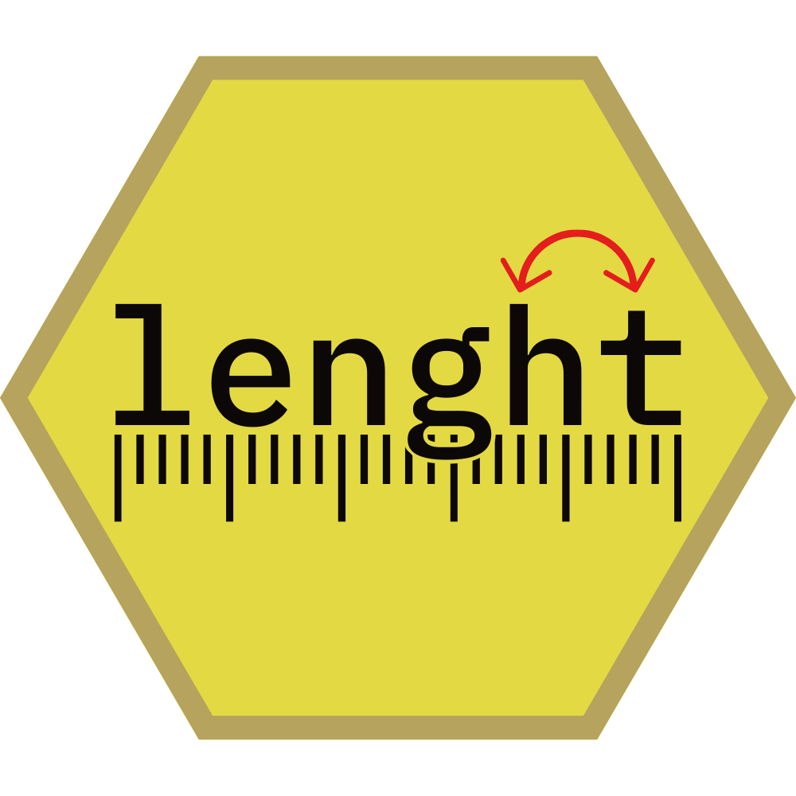

<!-- README.md is generated from README.Rmd. Please edit that file -->

# lenght 

<!-- badges: start -->

[](https://github.com/cobrbra/lenght/actions/workflows/R-CMD-check.yaml)
[](https://app.codecov.io/gh/cobrbra/lenght?branch=main)
<!-- badges: end -->

The goal of `lenght` is to provide convenient aliases for each of the
common misspellings of the R function `length`, a problem that haunts us
all.

## Authors

*Creators* and *contributors*: Isabella Deutsch, Jacob Bradley<br>
*Maintainer*: Jacob Bradley

## Installation

You can install the development version of `lenght` from
[GitHub](https://github.com/) with:

``` r
# install.packages("devtools")
devtools::install_github("cobrbra/lenght")
```

or via CRAN with

``` r
install.packages("lenght"):
```

## Usage

The intended use of this package is in the ideation stage of a project.
It allows the user to code seamlessly without pesky typos interrupting
the workflow. It also focuses debugging on more relevant errors in the
code. Partially inspired by an author’s minor struggles with dyslexia.

We recommend editing code intended for production or publication such
that it successfully runs without this package.

## Example

You can use the functions in `lenght` to do anything the base R function
`length` would do.

``` r
library(lenght)
#> 
#> Attaching package: 'lenght'
#> The following object is masked from 'package:base':
#> 
#>     length
print(lenght(1:4))
#> [1] 4

print(lentgh(options()))
#> [1] 72

print(lenhgt(NULL))
#> [1] 0
```

## Contact

Feel free to leave issues or pull requests on our GitHub
[repository](https://github.com/cobrbra/lenght), or alternately to
contact the package maintainer Jacob by
[email](mailto:cobrbradley@gmail.com).
